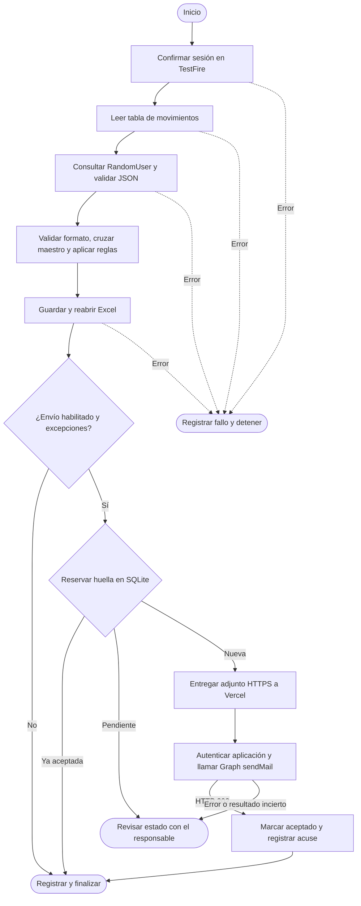

# Flujo del robot EP3

```mermaid
flowchart TD
    A([Inicio]) --> B[Confirmar sesión en TestFire]
    B --> C[Leer tabla de movimientos]
    C --> D[Consultar RandomUser y validar JSON]
    D --> E[Validar formato, cruzar maestro y aplicar reglas]
    E --> F[Guardar y reabrir Excel]
    F --> G{¿Envío habilitado y excepciones?}
    G -- No --> L([Registrar y finalizar])
    G -- Sí --> H{Reservar huella en SQLite}
    H -- Ya aceptada --> L
    H -- Pendiente --> M([Revisar estado con el responsable])
    H -- Nueva --> I[Entregar adjunto HTTPS a Vercel]
    I --> J[Autenticar aplicación y llamar Graph sendMail]
    J -- HTTP 202 --> K[Marcar aceptado y registrar acuse]
    K --> L
    J -- Error o resultado incierto --> M
    B -. Error .-> N([Registrar fallo y detener])
    C -. Error .-> N
    D -. Error .-> N
    F -. Error .-> N
```
